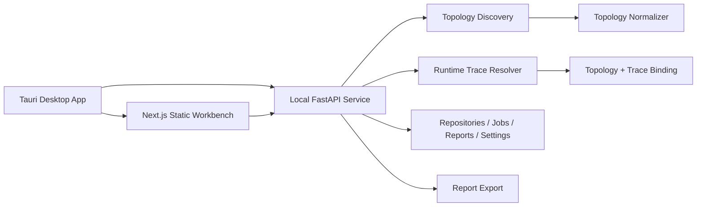

# Agent_City

Agent_City is a desktop workbench for parsing, visualizing, and diagnosing AI agent systems. It turns an agent codebase into a city model: districts are architecture domains, buildings are modules, roads are dependencies, and moving flows are runtime trace events.

Agent_City 是一个面向 AI Agent 系统的桌面工作台。它把 Agent 源码解析成“软件城市”：街区代表架构域，建筑代表模块，道路代表依赖关系，动态流线代表运行时 trace / span / event。

Repository: <https://github.com/Sgt-Friedrich/Agent_City>

---

## Why This Project Exists / 项目目标

Modern agent projects are difficult to understand because static architecture, runtime behavior, tool calls, memory access, MCP integrations, and fallback paths are usually scattered across code, config, logs, and prompt templates.

Agent_City closes that loop:

- Import a local agent repository.
- Parse topology from source code, configuration, registries, and workflow definitions.
- Normalize modules into districts, nodes, and edges.
- Bind runtime traces to the static topology.
- Replay a prompt execution path through the city.
- Diagnose slow, failed, inferred, retry, and fallback links.
- Export parser, diagnostics, and system reports.

现代 Agent 项目通常很难理解，因为静态架构、运行时行为、工具调用、记忆访问、MCP 集成和 fallback 路径分散在代码、配置、日志和 prompt 模板里。

Agent_City 的目标是形成闭环：

- 导入本地 Agent 仓库。
- 从源码、配置、注册表和工作流定义中解析拓扑。
- 归一化为街区、节点、边。
- 将运行时 trace 绑定到静态拓扑。
- 以城市路径回放一次 prompt 执行过程。
- 诊断慢链路、错误链路、推断边、重试和 fallback。
- 导出解析、诊断和系统报告。

---

## Desktop App Entry / 桌面 App 启动

The main entry is:

```bash
npm run app:start
```

Windows helper launchers:

```text
start-agent-city.bat
start-agent-city.ps1
```

The startup script bootstraps frontend dependencies, the static UI bundle, the backend Python environment, and the Tauri desktop shell. The intended user experience is one-click local startup, not a browser-only dashboard.

主入口是：

```bash
npm run app:start
```

启动脚本会处理前端依赖、静态 UI 包、本地 Python 后端环境和 Tauri 桌面壳。项目定位是本地桌面 App 工作台，而不是浏览器里的临时 dashboard。

---

## Core Views / 核心视图

- `Overview`: city-level static architecture and dominant routes.
- `Live`: real-time flow events and active trace movement.
- `Replay`: step-by-step prompt execution replay.
- `Diagnostics`: slow links, errors, retry, fallback, inferred runtime edges.
- `Parser Analysis`: parser confidence, unresolved symbols, fix queue, promotable inferred edges.
- `Repositories`: imported local repositories and parse health.
- `Jobs`: parse, regression, self-check, report, and cleanup task status.
- `Reports`: generated parser, diagnostics, frontend, and full-system reports.
- `Settings`: workspace paths, flow mode, language, logging, cleanup threshold.

---

## Architecture / 系统架构



Backend layers:

- `backend/app/parsers`: Python, TypeScript, Go, Rust, Java, C#, and config parsers.
- `backend/app/services/topology_discovery.py`: discovers raw components, relations, unresolved symbols, and provenance.
- `backend/app/services/topology_normalizer.py`: normalizes discovered signals into the city topology schema.
- `backend/app/services/runtime_trace_resolver.py`: creates trace/span/flow event models.
- `backend/app/services/topology_binding.py`: binds runtime events to static nodes and edges.
- `backend/app/services/platform_service.py`: coordinates targets, traces, parser analysis, diagnostics, and jobs.

Frontend layers:

- `frontend/components/city`: 3D city, buildings, districts, roads, live flows, mini-map.
- `frontend/components/analysis`: control plane, parser analysis, repositories, jobs, reports, settings.
- `frontend/components/panels`: inspector, filters, command palette, timeline, import wizard.
- `frontend/store/useDashboardStore.ts`: desktop workbench state.
- `frontend/i18n/messages.ts`: English and Chinese text resources.

---

## Data Model / 数据模型

Core schema objects:

- `District`: architecture domain such as Planning, Runtime, Tools, LLM, Memory, Safety.
- `Node`: concrete module, service, tool, model gateway, retriever, memory, runtime, or external boundary.
- `Edge`: declared, observed, inferred, retry, fallback, dependency, or dataflow edge.
- `TraceEnvelope`: one user request or prompt run.
- `SpanEvent / FlowEvent`: runtime step with protocol, payload preview, latency, status, retry, fallback.
- `NodeMetricSnapshot`: qps, p95 latency, error rate, active count, queue depth, token and cost rates.

---

## Runtime Modes / 运行时模式

Agent_City separates simulated flow from real activity:

- `always_simulated`: stream mock runtime flows for demonstration and UI testing.
- `manual`: pause automatic live flow emission.
- `codex_real_only`: emit Codex-target flow only when a Codex app-server process shows real activity.

This distinction is visible in the app header so the user can tell whether the city is showing mock flow, paused flow, or gated Codex activity.

---

## Parser Intelligence / 解析能力

The parser is designed for unfamiliar agent systems. It uses multiple lightweight strategies instead of requiring every project to run:

- Directory and filename heuristics.
- Config parsing for YAML, TOML, JSON, and `.env`.
- Registry, factory, decorator, plugin loader, toolset attach, and MCP mount patterns.
- README/example/config hints.
- Confidence scoring across code, config, registry, and runtime consistency.
- Graceful degradation with unresolved reasons.
- Promotable inferred edges when runtime observations are stable.

Regression samples currently cover multiple ecosystems, including Python, TypeScript, Go, Rust, Java/JVM, and mixed agent frameworks.

---

## Built With Codex / Codex 构建方式

This project was developed with Codex as an iterative engineering partner. The workflow was:

1. Break the product into static parsing, runtime tracing, city visualization, desktop shell, and control plane.
2. Ask Codex to implement code directly in the local repository.
3. Run builds, parser tests, app smoke tests, and UI checks after each major change.
4. Use Codex to inspect failures, patch regressions, and improve the product loop.
5. Test the parser against real agent projects such as Codex, Claude Code, OpenClaw, and Hermes-style self-evolving agents.

Codex helped implement the FastAPI backend, parser services, topology binding, Next.js + React Three Fiber UI, Zustand state, Tauri startup path, i18n, settings persistence, live flow gating, parser analysis, and product-level UI refinements.

这个项目是通过 Codex 进行长链路工程迭代完成的。整体流程是：

1. 将产品拆成静态解析、运行时追踪、城市可视化、桌面壳和控制平面。
2. 让 Codex 直接在本地仓库中读写代码。
3. 每轮改动后运行构建、解析测试、App smoke 和界面检查。
4. 用 Codex 定位失败、修复回归、持续优化产品闭环。
5. 使用 Codex / Claude Code / OpenClaw / Hermes 等真实 Agent 项目验证解析能力。

---

## Validation / 验证命令

```bash
npm run frontend:build
npm run parser:test
npm run app:smoke
npm run system:test
```

Useful frontend checks:

```bash
npm --prefix frontend run e2e:app
npm --prefix frontend run screenshots:app
```

---

## Screenshots / 界面截图

Screenshots are stored under `docs/screenshots/`.

Examples:

- `docs/screenshots/dashboard-overview-desktop.png`
- `docs/screenshots/dashboard-diagnostics-desktop.png`
- `docs/screenshots/dashboard-parser-analysis-desktop.png`
- `docs/screenshots/dashboard-replay-desktop.png`
- `docs/screenshots/dashboard-settings-desktop.png`

---

## Current Boundaries / 当前边界

- Real telemetry adapters are scaffolded, but the default runtime flow is still mock or locally gated.
- Static parsing is heuristic and intentionally lightweight; it does not compile every external project.
- Large dynamic agent systems may still require custom parser rules for project-specific registries.
- The city layout is optimized for analysis, but very large graphs still benefit from clustering and focused subgraph views.

---

## Roadmap / 后续方向

- OpenTelemetry / Jaeger / Tempo / Langfuse / Phoenix adapters.
- Better cluster inspector for dense Runtime and Tools districts.
- Rule authoring workflow for parser fix queues.
- Structured report actions that create follow-up jobs.
- Packaged desktop releases for Windows/macOS/Linux.
- More parser regression fixtures for self-evolving and multi-agent systems.

