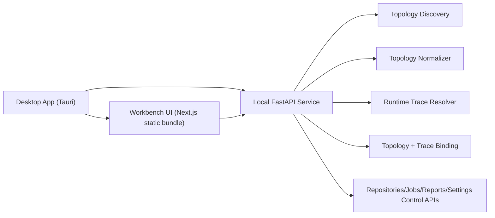
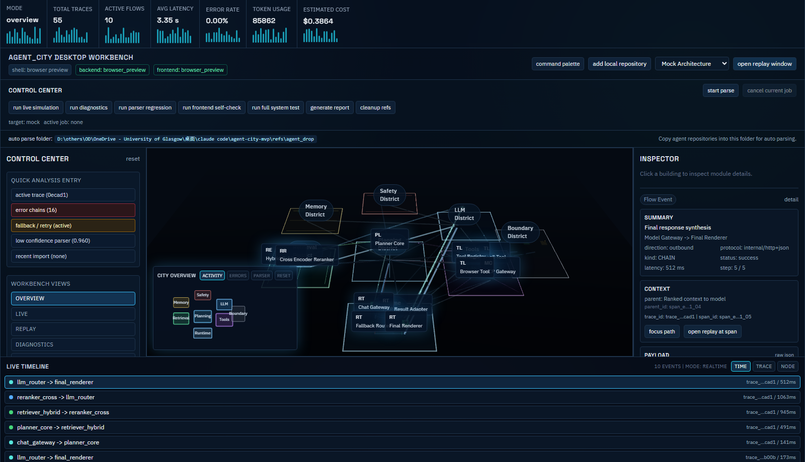
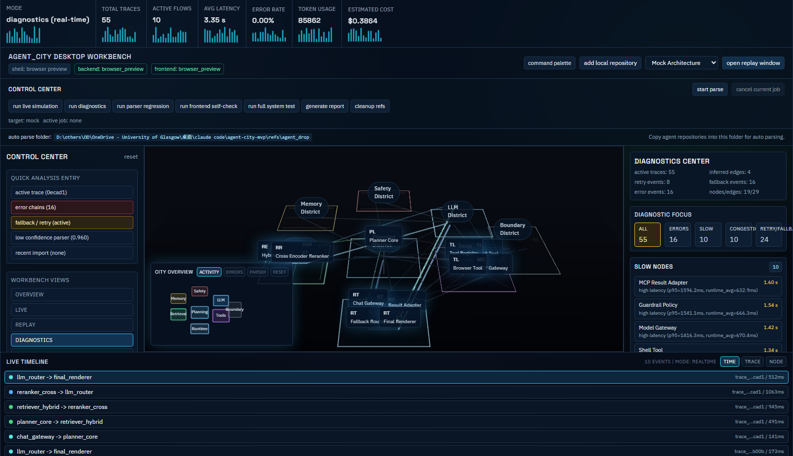
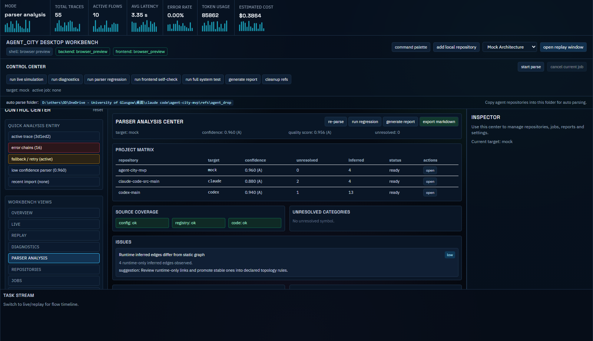
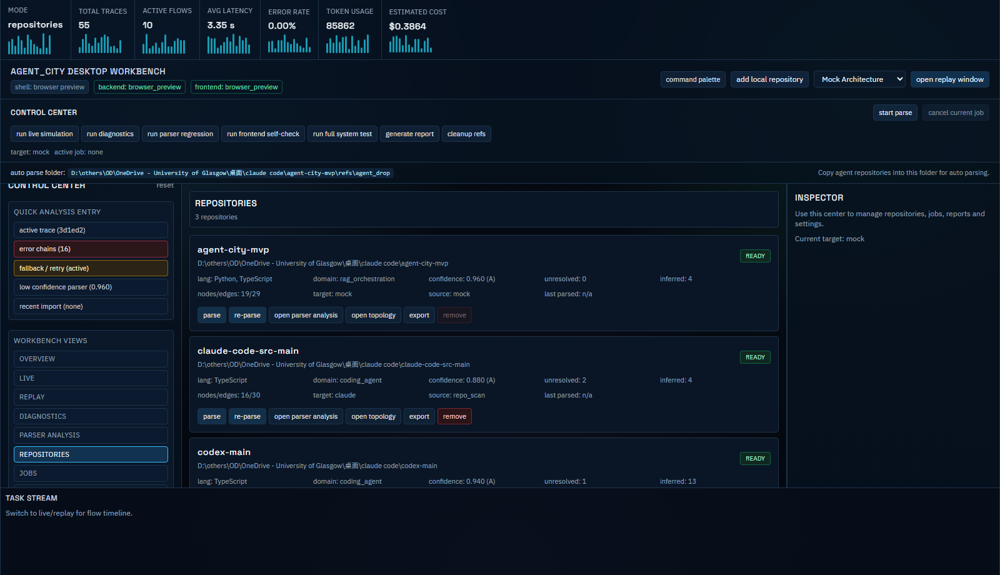
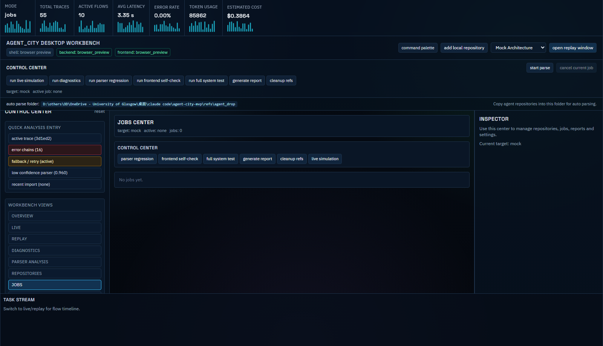
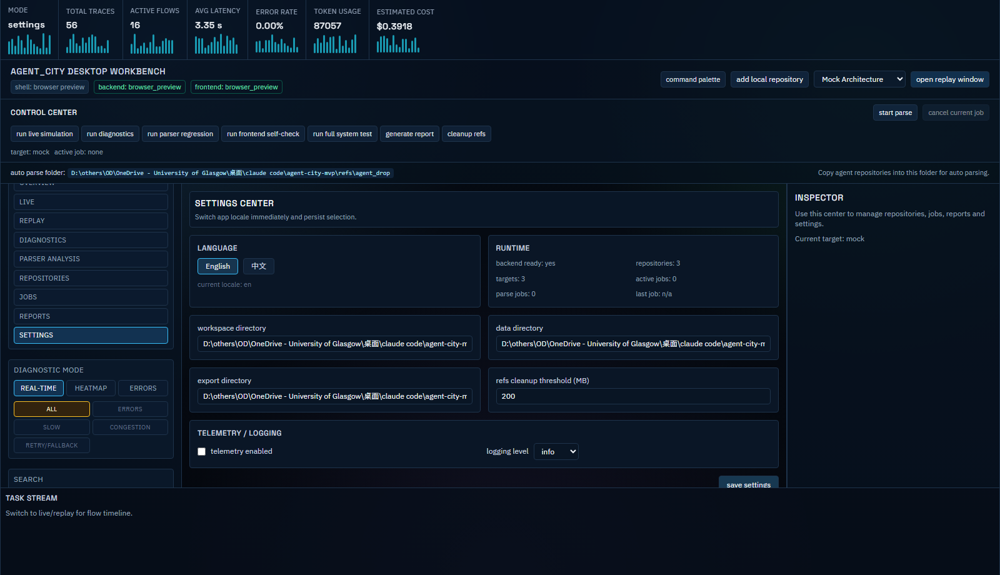
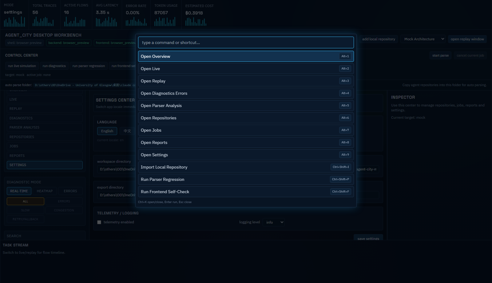
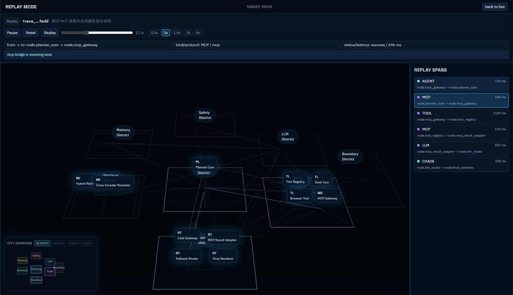
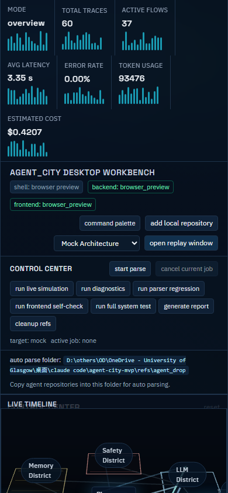

# Agent_City Desktop App / Agent_City 桌面应用

Agent_City is a **desktop control-plane workbench** for agent architecture parsing and runtime observability.  
Agent_City 是一个面向 Agent 架构解析与运行时可观测的**桌面控制平面工作台**。

It is not a browser demo. It is a local App that closes the loop from repository import to parse, city visualization, diagnostics, replay, reporting, and regression tests.  
它不是网页演示，而是本地 App：从导入仓库到解析、城市可视化、诊断、回放、报告和回归测试形成闭环。

---

## 1. Product Positioning / 产品定位

**English**
- Desktop-native workbench (Tauri shell + local FastAPI service)
- Static architecture parsing + runtime trace binding
- City metaphor + observability diagnosis + parser quality analysis
- Control Plane for repositories, jobs, reports, settings

**中文**
- 桌面原生工作台（Tauri 壳 + 本地 FastAPI 服务）
- 静态架构解析 + 运行时链路绑定
- 城市隐喻可视化 + 诊断 + 解析质量分析
- 提供仓库、任务、报告、设置的完整控制平面

---

## 2. One-Click Entry / 一键启动入口

```bash
npm run app:start
```

Windows shortcuts:
- `start-agent-city.bat`
- `start-agent-city.ps1`

`app:start` bootstraps dependencies, static UI bundle, backend venv, and starts the desktop App flow.

---

## 3. Core Workbench Views / 核心工作台视图

- `Overview`
- `Live`
- `Replay`
- `Diagnostics`
- `Parser Analysis`
- `Repositories`
- `Jobs`
- `Reports`
- `Settings`

Main window layout:
- Top: KPI + shell/service status + global controls
- Left: view switching + filters + quick analysis entry
- Center: city workspace / parser center / repositories/jobs/reports/settings center
- Right: inspector / diagnostics details
- Bottom: timeline / task stream

Interaction accelerators:
- clickable KPI cards with trend sparklines
- semantic mini-map navigator (activity/errors/parser overlays)
- search DSL (`type:tool`, `status:error`, `has:retry`, `latency>700`, `qps>10`, `-term`)
- command palette + keyboard shortcuts (`Ctrl/Cmd+K`, `Alt+1..9`)
- intelligent next-step recommendations in inspector

---

## 4. Control Plane Modules / 控制平面模块

### Repositories / 仓库中心
- import local repository
- recent repository list
- parser confidence / unresolved / inferred edges
- parse / re-parse / open topology / open parser analysis / remove / export

### Jobs / 任务中心
- parse repository / re-parse
- parser regression
- frontend self-check
- full system test
- generate report
- cleanup refs
- live simulation

Each job has status, progress, timestamps, log summary, detail output, and optional artifact path.

### Reports / 报告中心
- parser reports
- capability summaries
- diagnostics summary
- full-system test report
- frontend fix report

### Settings / 设置中心
- workspace/data/export directory
- cleanup threshold
- telemetry/logging options
- runtime status snapshot
- **language switch (中文 / English)**

---

## 5. Language Switching / 语言切换

Language switching is implemented as a real product feature:
- supported locales: `en`, `zh`
- locale state persisted locally (Zustand persist)
- immediate UI update after switching
- backend settings persistence via `/api/control/settings`
- fallback dictionary strategy for safe extension

Key files:
- `frontend/i18n/messages.ts`
- `frontend/store/useLocaleStore.ts`
- `frontend/hooks/useI18n.ts`
- `frontend/components/analysis/SettingsCenter.tsx`

Internationalized coverage in this phase includes:
- top status/header core text
- left navigation and major filters
- control center actions
- repositories/jobs/reports/settings core text
- common empty/error/success states
- repository import wizard key text

---

## 6. Architecture / 系统架构



More details:
- [docs/architecture.md](docs/architecture.md)
- [docs/app-workbench-design.md](docs/app-workbench-design.md)
- [docs/product-ux.md](docs/product-ux.md)

---

## 7. Local APIs / 本地服务接口

### Topology + Runtime
- `GET /api/targets`
- `POST /api/targets/preview`
- `POST /api/targets/register`
- `GET /api/topology`
- `GET /api/traces`
- `GET /api/traces/{trace_id}`
- `GET /api/nodes/{node_id}`
- `GET /api/metrics/summary`
- `GET /ws/live`

### Analysis
- `GET /api/analysis/diagnostics`
- `GET /api/analysis/parser`
- `GET /api/analysis/report`

### Control Plane
- `GET /api/control/repositories`
- `DELETE /api/control/repositories/{target_id}`
- `GET /api/control/jobs`
- `POST /api/control/jobs`
- `POST /api/control/jobs/{job_id}/cancel`
- `GET /api/control/settings`
- `PUT /api/control/settings`
- `GET /api/control/runtime`

---

## 8. Project Structure / 目录结构

```text
agent-city-mvp/
  backend/            # FastAPI local service + parser/runtime core
  frontend/           # desktop workbench UI (Next.js + R3F + Zustand)
  desktop/            # Tauri shell
  docs/               # architecture, UX, reports, test outputs
  scripts/            # bootstrap, cleanup, full-system testing
  tests/              # parser/control API regression tests
  .agents/            # Codex self-debug skill chain
```

---

## 9. Validation Commands / 验证命令

```bash
# parser and control-plane regression
npm run parser:test

# app-oriented UI regression (static bundle + backend + playwright)
npm --prefix frontend run e2e:app

# desktop shell smoke
npm run app:smoke

# full closure test
npm run system:test
```

Latest full-system report path:
- `docs/full-system-test-report.md`

---

## 10. Latest Update (2026-04-02) / 最新更新（2026-04-02）

- Control Plane upgraded with Repositories/Jobs/Settings centers.
- Parser Analysis upgraded to a full quality center (matrix + quick actions).
- Diagnostics enhanced with dedicated focus layers (`errors/slow/congestion/retry_fallback`).
- Search DSL upgraded (`key:value`, `!=`, `has:*`, numeric filters like `latency>700`).
- Command Palette + keyboard shortcuts added (`Ctrl/Cmd+K`, `Alt+1..9`).
- Mini-map upgraded as a semantic navigator with overlay-driven jumps.

---

## 11. Screenshots / 展示截图

### Overview (Desktop)


### Diagnostics


### Parser Analysis Center


### Repositories Center


### Jobs Center


### Settings Center


### Command Palette


### Replay


### Overview (Mobile)


To refresh screenshots locally:
```bash
npm --prefix frontend run screenshots:app
```

---

## 12. Cleanup Mechanism / 参考仓库清理机制

```bash
python scripts/cleanup_refs.py --root . --targets refs --threshold-mb 200 --keep-list-file docs/parser-tested-keep.txt --delete-unlisted --dry-run
```

Rules:
- delete any reference directory larger than 200MB
- delete unlisted reference repos when `--delete-unlisted` is enabled
- keep only project source + necessary reports/fixtures

---

## 13. Self-Debug Toolchain / 自调试工具链

- `AGENTS.md`
- `.agents/skills/frontend-repro`
- `.agents/skills/frontend-visual-debug`
- `.agents/skills/frontend-fix`
- `.agents/skills/frontend-regression`
- `.agents/skills/frontend-report`

Used for App UI issue reproduction, evidence capture, minimal fix, and regression closure.

---

## 14. Known Boundaries / 已知边界

- Parser is heuristic-first with graceful degradation for unknown frameworks.
- Large topologies may still benefit from future clustering/aggregation strategies.
- Production signing/notarization for desktop distribution is outside current scope.

---

## 15. Next Extension Direction / 后续扩展方向

- OpenTelemetry / Jaeger / Langfuse / Phoenix adapters
- richer command palette + desktop shortcut map
- deeper parser rule packs for uncommon agent frameworks
- packaged release pipeline for desktop distributions
