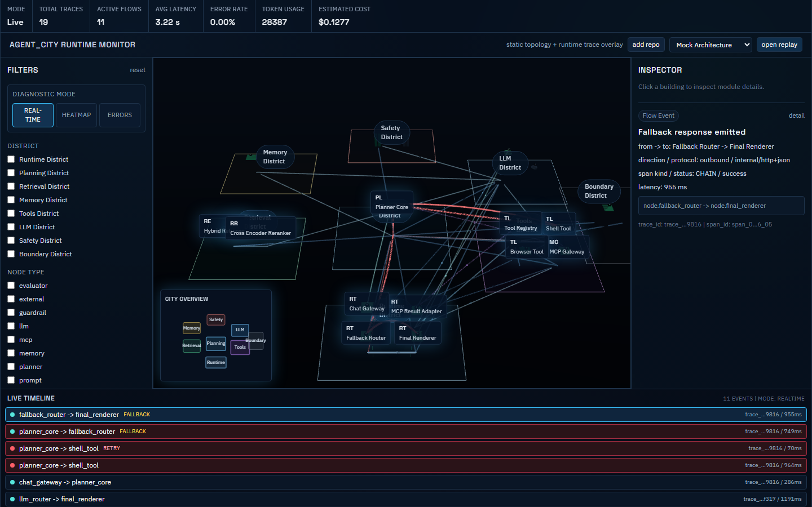
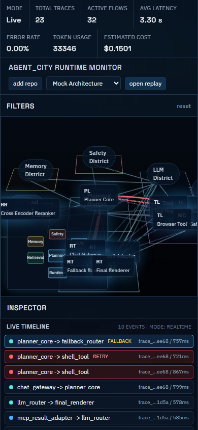
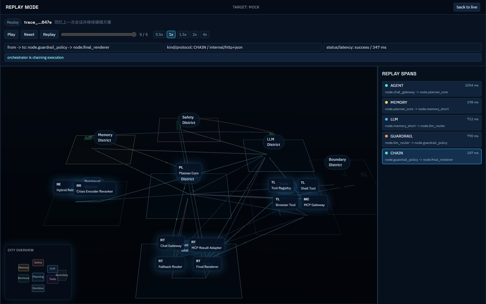

# Agent_City Desktop App

Agent_City 是一个本地桌面工作台（Desktop Workbench），用于 Agent 系统的静态架构解析、运行时链路追踪、城市化可视表达、回放诊断与报告输出。

Agent_City is a local desktop workbench for agent architecture parsing, runtime tracing, city-style observability, replay diagnostics, and report export.

---

## 1. 为什么它不是普通网页工具 | Why This Is Not a Typical Web Dashboard

**中文**
- 这是一个桌面 App 工作台，不是单页演示。
- 覆盖从解析 -> 观测 -> 诊断 -> 回放 -> 报告的闭环。
- 支持本地服务编排、数据流可视化和问题定位。

**English**
- This is a desktop app workbench, not a static web demo.
- It covers a full loop: parse -> observe -> diagnose -> replay -> report.
- It supports local service orchestration, data-flow visualization, and troubleshooting.

---

## 2. 核心能力 | Core Capabilities

1. 静态架构解析（Topology discovery + normalizer）
2. 运行时追踪（trace / span / flow event）
3. 城市化可视表达（district / node / edge / flow）
4. Replay 回放与 Diagnostics 诊断
5. Parser Analysis（confidence / unresolved / inferred）
6. Reports Center（导出与归档）

---

## 3. 技术栈 | Stack

- Desktop shell: **Tauri**
- Frontend: Next.js + React + TypeScript + Tailwind + React Three Fiber + Zustand
- Local backend: FastAPI + WebSocket

---

## 4. 展示截图 | Screenshots

### Desktop Main Workbench


### Mobile Layout Preview


### Replay View


---

## 5. 项目结构 | Project Structure

```text
Agent_City/
  desktop/                     # Tauri desktop shell
    src-tauri/
    scripts/run-tauri.js
  frontend/                    # workbench UI
  backend/                     # local FastAPI service
  docs/                        # architecture/ux/reports
  tests/                       # parser regression tests
  scripts/                     # bootstrap, cleanup, full-system test
  .agents/                     # Codex self-debug workflow
```

---

## 6. 一键启动（推荐） | One-Click Startup (Recommended)

```bash
npm run app:start
```

Windows 也可直接双击：
- `start-agent-city.bat`
- 或 `start-agent-city.ps1`

### 启动脚本会自动做什么 | What bootstrap does

1. 自动安装 `frontend` 依赖（如果缺失）
2. 自动安装 `desktop` 依赖（如果缺失）
3. 自动构建/复用前端静态包（`frontend/out`）
4. 自动创建 `backend/.venv`
5. 自动安装后端 Python 依赖并确保本地 backend 就绪
6. 自动拉起 Tauri 桌面应用

运行时不再依赖 `next dev` 开发服务器，桌面壳直接加载本地静态资源（App 逻辑）。

### linker 兼容策略（Windows） | Windows linker fallback

- 若系统找不到 `link.exe`，启动脚本会优先尝试 `rust-lld` 兜底。
- 若检测到本地 MSVC linker 在磁盘中但未进 PATH，会自动注入 linker 目录后启动。
- 这样可以避免“必须手工先跑 VsDevCmd 才能启动”的问题。

---

## 7. 先决条件 | Prerequisites

- Node.js + npm
- Python 3
- Rust toolchain（rustup/cargo）
- Windows 建议安装 Visual Studio Build Tools（C++ workload）；如果未配置好 `link.exe`，项目会尝试走 `rust-lld` fallback

---

## 8. 手动启动（可选） | Manual Startup (Optional)

```bash
# backend
cd backend
python -m uvicorn app.main:app --host 127.0.0.1 --port 8000

# frontend
npm --prefix frontend run dev

# desktop
npm --prefix desktop run dev
```

---

## 9. 工作台视图 | Workbench Views

- Overview
- Live
- Replay
- Diagnostics
- Parser Analysis
- Reports

布局：顶部 KPI、左侧过滤、中央城市视图、右侧检查器、底部时间线。

---

## 10. 本地 API | Local Service APIs

### Topology & Runtime
- `GET /api/targets`
- `POST /api/targets/register`
- `GET /api/topology?target=...`
- `GET /api/traces?target=...`
- `GET /api/traces/{trace_id}?target=...`
- `GET /api/nodes/{node_id}?target=...`
- `GET /api/metrics/summary?target=...`
- `GET /ws/live?target=...`

### Parsing Jobs
- `GET /api/parse-jobs`
- `POST /api/parse-jobs/scan`

### Analysis
- `GET /api/analysis/diagnostics?target=...`
- `GET /api/analysis/parser?target=...`
- `GET /api/analysis/report?target=...&fmt=markdown|json`

---

## 11. 解析器核心模块 | Parser Core Modules

- `backend/app/services/topology_discovery.py`
- `backend/app/services/topology_normalizer.py`
- `backend/app/services/runtime_trace_resolver.py`
- `backend/app/services/topology_binding.py`
- `backend/app/services/confidence_scoring.py`
- `backend/app/parsers/*.py`

支持 declared / observed / inferred edge，retry/fallback loop，unresolved symbols 与 confidence。

---

## 12. 自调试工具链 | Self-Debug Toolchain

- `AGENTS.md`
- `.agents/skills/frontend-repro`
- `.agents/skills/frontend-visual-debug`
- `.agents/skills/frontend-fix`
- `.agents/skills/frontend-regression`
- `.agents/skills/frontend-report`

用于本项目自身界面问题的复现、定位、修复与回归。

---

## 13. 测试命令 | Test Commands

### Parser regression
```bash
python -m unittest discover -s tests/parser -p "test_*.py" -v
python scripts/run_parser_retest.py
```

### App UI automation (static bundle)
```bash
npm --prefix frontend run e2e:app
```

### Desktop smoke
```bash
npm --prefix desktop run test:smoke
npm run app:smoke
```

### Full system
```bash
python scripts/run_full_system_tests.py
```

---

## 14. 清理机制 | Cleanup

```bash
python scripts/cleanup_refs.py --root . --targets refs --threshold-mb 200 --keep-list-file docs/parser-tested-keep.txt --delete-unlisted --dry-run
```

规则：
- 单个参考目录 > 200MB 自动删除
- 未在保留清单中的参考目录可删除
- `refs/agent_drop` 用作临时投递目录

---

## 15. 文档索引 | Docs Index

- `docs/architecture.md`
- `docs/product-ux.md`
- `docs/app-workbench-design.md`
- `docs/parser-test-plan.md`
- `docs/parser-test-results.md`
- `docs/parser-capability-summary.md`
- `docs/parser-fix-report-template.md`
- `docs/frontend-debug-playbook.md`
- `docs/frontend-fix-report-template.md`
- `docs/full-system-test-report.md`
- `docs/reference-notes.md`

---

## 16. 已知边界 | Known Boundaries

1. 当前桌面壳以 Windows + Tauri 为优先。
2. 多语言静态解析采用启发式 + 规则融合，不是全量 AST 编译级求解。
3. 高度动态注册项目仍可能出现 partial parse（已做 graceful degradation）。

---

## 17. 后续扩展 | Future Extensions

- OpenTelemetry / Jaeger / Phoenix / Langfuse adapters
- richer desktop shortcuts/menu integrations
- CI pipeline for full-system closure tests
