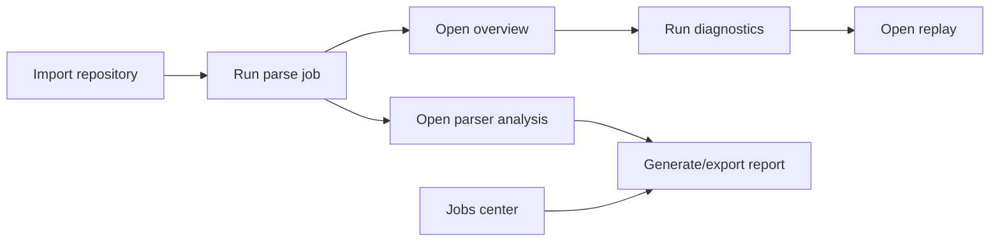

# App Workbench Design

## 1. Workbench Scope

Agent_City is a desktop workbench that combines:
- architecture parsing,
- runtime observability,
- control-plane operations,
- diagnostics and replay,
- reporting and verification loops.

## 2. Main Window Regions

1. Top strip
- KPI cards
- service status
- global actions

2. Left panel
- mode navigation
- quick analysis entry
- filters and legends

3. Center panel
- city workspace or control center views

4. Right panel
- inspector and diagnostics details

5. Bottom panel
- timeline or task stream

## 3. View Matrix

| Mode | Primary intent | Center content | Right content | Bottom content |
|---|---|---|---|---|
| Overview | Understand architecture | City map | Inspector | Timeline |
| Live | Observe runtime flow | City + flow overlays | Inspector | Timeline |
| Replay | Path/time replay | City replay | Inspector | Timeline |
| Diagnostics | Find issues fast | City diagnostics overlays | Diagnostics inspector | Timeline |
| Parser Analysis | Evaluate parse quality | Parser analysis center | Diagnostics inspector | Timeline |
| Repositories | Manage repo sources | Repository center | Generic inspector | Task stream |
| Jobs | Track operations | Jobs center | Generic inspector | Task stream |
| Reports | Browse/export reports | Reports center | Generic inspector | Task stream |
| Settings | Configure app behavior | Settings center | Generic inspector | Task stream |

## 4. Control Plane Workflow

## 5. Language Switching Flow

1. User opens Settings.
2. User selects `English` or `中文`.
3. Locale store updates immediately.
4. Settings are persisted through control API.
5. Next app launch restores last selected language.

## 6. Desktop-Specific Design Points

- all workflows are local-first and app-oriented
- no dependency on frontend dev server for normal startup
- shell bridge supports open path/save reports and service status
- long-running sessions are supported by local backend polling + WebSocket flow stream

## 7. Operational Feedback Design

- job status badges: queued/running/success/failed/cancelled
- parse progress banner always visible
- toast-like inline messages inside Repositories/Jobs/Settings centers
- direct action chaining between centers and city modes
