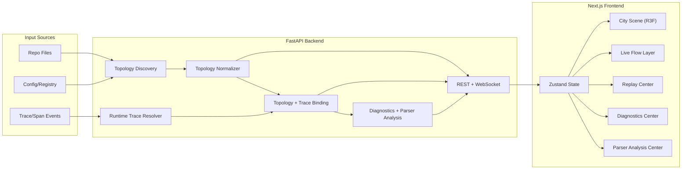
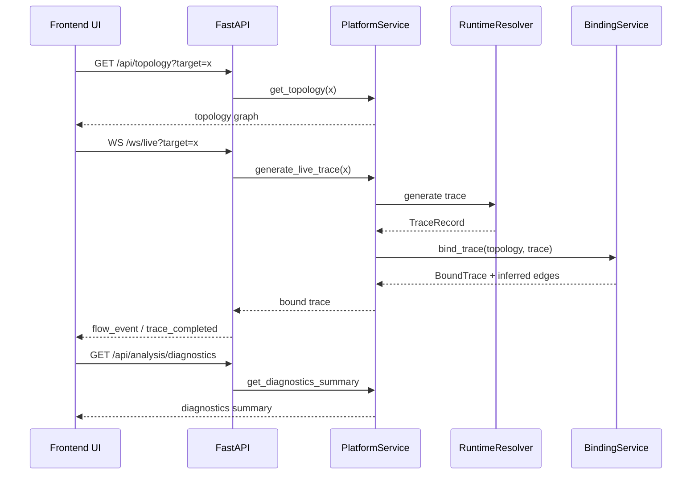

# Agent_City Architecture

## 1. Positioning
Agent_City is a full-stack platform for **static architecture parsing + runtime trace binding + city-style observability rendering**.

Core loop:
1. Discover architecture signals from source/config/registry/workflow.
2. Normalize signals into unified topology (`districts/nodes/edges`).
3. Resolve runtime traces and bind spans to topology.
4. Render structure + behavior + diagnostics in one workspace.
5. Feed parser gaps back into parser regression and fix workflow.

## 2. Layered Architecture

## 3. Backend Modules

### 3.1 Parsing and Topology
- `backend/app/services/topology_discovery.py`
- `backend/app/services/topology_normalizer.py`
- `backend/app/parsers/*.py` (Python/TypeScript/Go/Rust/Java/C#/Config)
- `backend/app/services/confidence_scoring.py`

### 3.2 Runtime and Binding
- `backend/app/services/runtime_trace_resolver.py`
- `backend/app/services/topology_binding.py`
- `backend/app/generators/live_event_generator.py`

### 3.3 Sources and Adapters
- `backend/app/sources/mock_*`
- `backend/app/sources/repo_topology_source.py`
- `backend/app/sources/intelligent_topology_source.py`
- `backend/app/services/telemetry_adapters.py`

### 3.4 API Surface
- Topology: `/api/targets`, `/api/topology`
- Runtime: `/api/traces`, `/api/traces/{id}`, `/ws/live`
- Metrics: `/api/metrics/summary`
- Parse jobs: `/api/parse-jobs`, `/api/parse-jobs/scan`
- Analysis: `/api/analysis/diagnostics`, `/api/analysis/parser`, `/api/analysis/report`

## 4. Frontend Modules

### 4.1 Application Shell
- `frontend/components/DashboardApp.tsx`
- Mode switching: `overview`, `live`, `diagnostics`, `parser_analysis`, replay route

### 4.2 Rendering Layer
- City scene and districts: `frontend/components/city/*`
- Live flows and hover cards: `frontend/components/city/LiveFlows.tsx`, `FlowEventHoverCard.tsx`
- Replay controls: `frontend/components/replay/*`

### 4.3 Analysis and Panels
- Diagnostics: `frontend/components/analysis/DiagnosticsCenter.tsx`
- Parser analysis: `frontend/components/analysis/ParserAnalysisCenter.tsx`
- KPI/filter/detail/timeline: `frontend/components/panels/*`

### 4.4 Data and State
- API client: `frontend/lib/api.ts`
- Global store: `frontend/store/useDashboardStore.ts`
- Bootstrap/live/parse/analysis hooks: `frontend/hooks/*`

## 5. Data Contracts
Core schemas are implemented in:
- Backend: `backend/app/models/schemas.py`
- Frontend: `frontend/types/schema.ts`

Primary contracts:
- `District`, `Node`, `Edge`
- `TraceEnvelope`, `SpanEvent/FlowEvent`
- `NodeMetricSnapshot`
- `DiagnosticsSummary`, `ParserAnalysisReport`
- `ParseJob`

## 6. Runtime Sequence (Simplified)

## 7. Ingest and Auto-Parse Flow
1. User copies a repository into `refs/agent_drop/`.
2. Backend startup loop scans the drop folder (`_auto_ingest_loop`).
3. A parse job is created and progresses through stages.
4. Frontend polls `/api/parse-jobs`, renders progress bar, and auto-switches target when completed.
5. City view refreshes with the new topology.

## 8. Quality and Regression
- Parser unit regression: `tests/parser/*`
- Frontend E2E regression: `frontend/tests/e2e/*`
- Reference cleanup: `scripts/cleanup_refs.py`
- Parser reports: `docs/parser-test-*.md`, `docs/parser-capability-summary.md`

## 9. Extension Points
- Replace mock runtime source with real telemetry adapters.
- Add dedicated OTel/Langfuse/Phoenix/Jaeger ingestion adapters.
- Expand language parsers with AST-level plugins when needed.
- Add CI pipeline to run parser + frontend regression on each PR.
