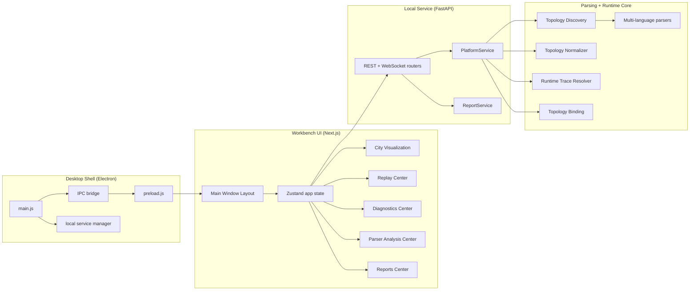

# Agent_City Architecture

## 1. Architecture Overview

Agent_City is a **desktop application workbench** composed of four layers:

1. Desktop shell layer (Electron)
2. UI workbench layer (Next.js/React)
3. Local service layer (FastAPI)
4. Parsing/runtime core layer (discovery/normalization/binding)

## 2. Layer Diagram

## 3. Desktop Shell Responsibilities

- Start and supervise local backend/frontend services when needed.
- Reuse existing local services if already running.
- Expose desktop-safe capabilities through preload bridge:
  - report save
  - open local path
  - app status query
- Keep renderer isolated from Node internals.

Code paths:
- `desktop/main.js`
- `desktop/preload.js`
- `desktop/src/serviceManager.js`

## 4. Local Service Responsibilities

### 4.1 Platform APIs
- Topology and target management
- Trace stream and replay data
- Metrics and diagnostics summary
- Parser analysis report generation

### 4.2 Reports APIs
- report catalog
- report content retrieval

Code paths:
- `backend/app/main.py`
- `backend/app/routers/*.py`
- `backend/app/services/platform_service.py`
- `backend/app/services/report_service.py`

## 5. Parsing and Runtime Core

### Static parsing
- `topology_discovery.py`
- `topology_normalizer.py`
- `parsers/*.py` (Python/TS/Go/Rust/Java/C#/Config)
- `confidence_scoring.py`

### Runtime parsing and binding
- `runtime_trace_resolver.py`
- `topology_binding.py`

### Semantics
- declared edge / observed edge / inferred edge / retry / fallback
- unresolved symbols + confidence + graceful degradation

## 6. Workbench UI Composition

Main window composition:

1. Top KPI/status strip
2. Left navigation + filters
3. Center workspace (city/parser/reports)
4. Right inspector (detail/diagnostics)
5. Bottom timeline

Primary modules:
- `frontend/components/DashboardApp.tsx`
- `frontend/components/city/*`
- `frontend/components/analysis/*`
- `frontend/components/panels/*`

## 7. Data Contracts

Canonical contract definitions:
- Backend: `backend/app/models/schemas.py`
- Frontend: `frontend/types/schema.ts`

Key entities:
- `District`, `Node`, `Edge`
- `TraceEnvelope`, `SpanEvent`, `FlowEvent`
- `DiagnosticsSummary`, `ParserAnalysisReport`
- `ReportArtifact`, `ReportContent`
- `DesktopAppStatus`

## 8. Test and Closure Loop

- Parser regression tests: `tests/parser/*`
- App UI automation tests: `frontend/tests/e2e/*`
- Full-system test runner: `scripts/run_full_system_tests.py`
- Reference cleanup: `scripts/cleanup_refs.py`

Outputs:
- parser reports
- frontend fix reports
- full system test report
