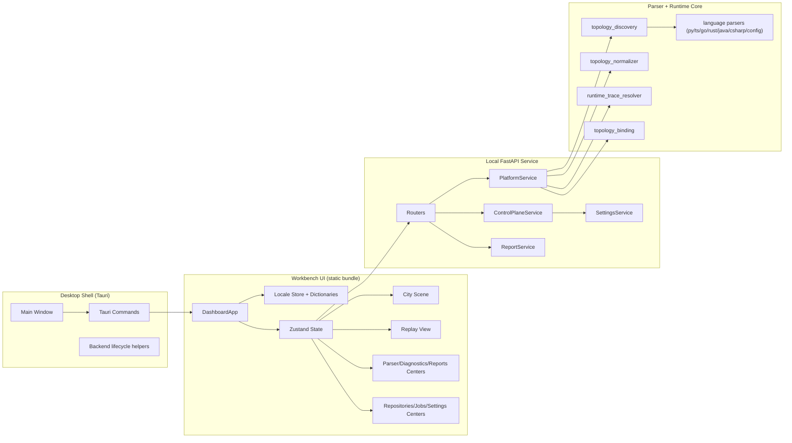

# Agent_City Architecture

## 1. System Layers

Agent_City is organized as four cooperating layers:

1. Desktop Shell Layer (Tauri)
2. Workbench UI Layer (Next.js/React/R3F)
3. Local Service Layer (FastAPI + WebSocket)
4. Parsing and Runtime Core Layer

## 2. High-Level Diagram

## 3. Control Plane Architecture

Control Plane is implemented in backend and consumed by dedicated UI centers.

### Backend
- `backend/app/services/control_plane_service.py`
- `backend/app/services/settings_service.py`
- `backend/app/routers/control.py`

### Data Models
- `RepositoryRecord`
- `JobRecord`
- `AppSettings`
- `AppRuntimeStatus`

### API Contract
- repository management
- job queue/execution/cancel
- settings read/write
- runtime status snapshot

## 4. Parsing + Runtime Core

### Static parsing
- topology discovery from code/config/readme/examples
- normalization into District/Node/Edge
- confidence scoring and unresolved symbols

### Runtime parsing
- trace envelope + span events
- retry/fallback/error semantics
- observed/inferred edge extraction

### Binding
- declared edge
- observed edge
- inferred edge
- fallback/retry loop handling

## 5. UI State and i18n

### State
- central store: `frontend/store/useDashboardStore.ts`
- locale store: `frontend/store/useLocaleStore.ts`
- control-plane polling: `frontend/hooks/useControlPlaneData.ts`

### i18n
- dictionaries: `frontend/i18n/messages.ts`
- locale helper: `frontend/hooks/useI18n.ts`
- persisted language + immediate switch in Settings

## 6. App Lifecycle

1. `npm run app:start` bootstraps dependencies and static assets.
2. Tauri main window loads static bundle.
3. UI fetches topology/metrics/traces/control-plane snapshots.
4. `/ws/live` streams flow events.
5. User actions in Control Center create and track jobs.

## 7. Validation Pipeline

- parser/control API tests: `npm run parser:test`
- app UI regression: `npm --prefix frontend run e2e:app`
- desktop shell smoke: `npm run app:smoke`
- full closure test: `npm run system:test`

## 8. Extension Points

- telemetry adapters (OTel/Jaeger/Langfuse/Phoenix)
- richer parser strategies for unknown frameworks
- desktop packaging/signing pipeline
